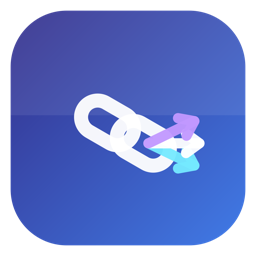

<p align="center">
  
</p>

# LinkDispatch

A macOS browser chooser app. Set it as your default browser and it intercepts every link click, letting you pick which browser to open it in — or auto-route URLs based on rules.

Inspired by [Choosy](https://choosy.app), [Velja](https://sindresorhus.com/velja), and [Browserosaurus](https://browserosaurus.com).

## Features

- **Menu bar app** — lives in the status bar, no dock icon
- **Browser detection** — finds all installed browsers via LaunchServices
- **Floating picker** — HUD-style panel shows browser icons near the cursor
- **Keyboard shortcuts** — press 1-9 to quickly pick a browser, Esc to dismiss
- **Rule engine** — auto-route URLs by pattern (e.g. `*.github.com` -> Chrome, `slack` -> Firefox)
- **Default browser fallback** — set a default for when no rules match
- **"Always ask" mode** — bypass rules and always show the picker

## Requirements

- macOS 13.0+
- Swift toolchain (comes with Xcode Command Line Tools: `xcode-select --install`)

## Build

No Xcode project needed. Build entirely from the CLI:

```bash
./build.sh
```

This compiles all Swift sources with `swiftc` and assembles a proper `.app` bundle in `build/LinkDispatch.app`.

## Run

```bash
open build/LinkDispatch.app
```

## Install

```bash
cp -r build/LinkDispatch.app /Applications/
```

Then set LinkDispatch as your default browser:

**System Settings > Desktop & Dock > Default web browser > LinkDispatch**

From then on, every link click system-wide will go through LinkDispatch.

## How It Works

1. LinkDispatch registers as an `http`/`https` URL handler via its `Info.plist`.
2. When set as the default browser, macOS sends all opened URLs to LinkDispatch.
3. The rule engine checks the URL against your configured rules (first match wins).
4. If a rule matches, the URL opens directly in the assigned browser.
5. If no rule matches and no default is set (or "always ask" is on), the floating picker appears.

## Project Structure

```
Sources/
  main.swift                 App entry point (menu bar agent app)
  AppDelegate.swift          URL event handling, status bar menu
  BrowserManager.swift       Detects installed browsers via LaunchServices
  BrowserPickerWindow.swift  Floating HUD picker with browser icons
  RuleEngine.swift           URL pattern matching and routing rules
  SettingsWindow.swift       Preferences UI (General + Rules tabs)
  Models.swift               BrowserInfo and Rule data models
Resources/
  Info.plist                 Registers app as http/https URL handler
build.sh                     CLI build script (no Xcode needed)
```

## Rule Patterns

Rules are matched against the URL's host and full URL string. Supported patterns:

| Pattern | Matches |
|---|---|
| `github.com` | Any URL containing `github.com` |
| `*.google.com` | `mail.google.com`, `docs.google.com`, etc. |
| `slack` | Any URL containing `slack` |

Rules are evaluated top-to-bottom. First match wins.

## License

MIT
